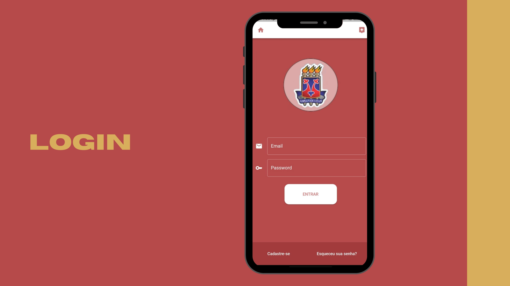
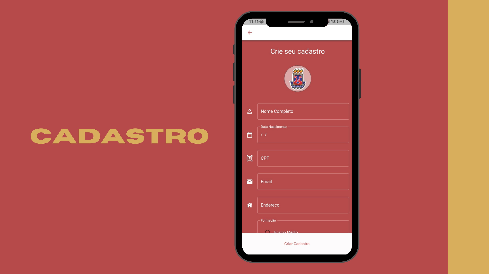
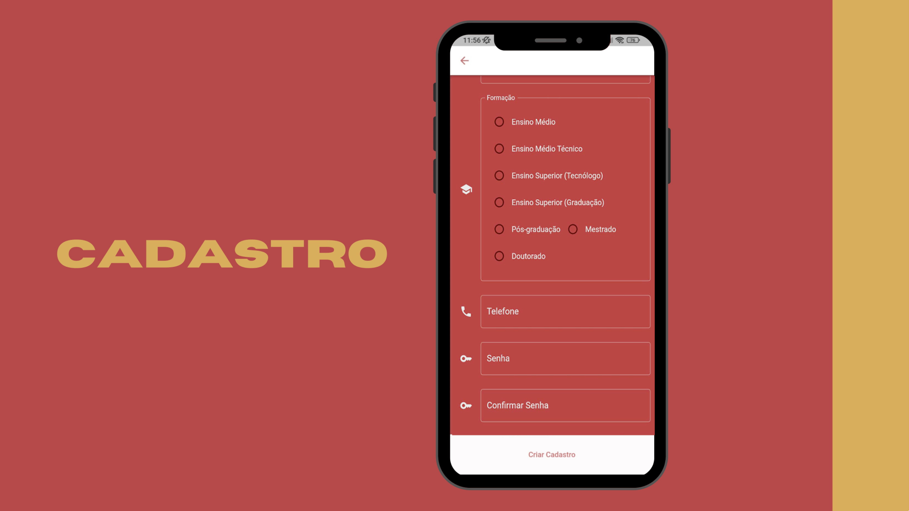
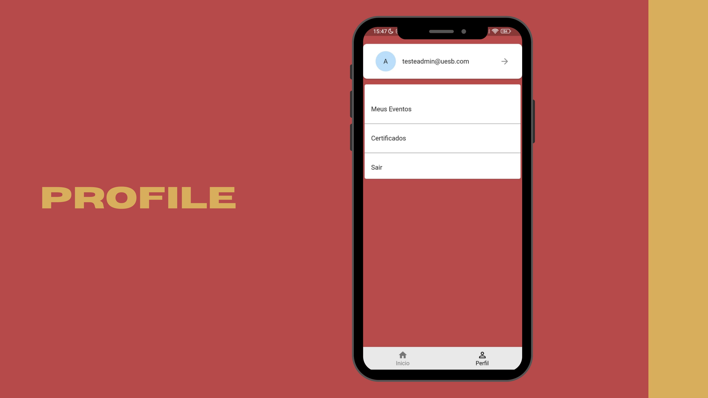
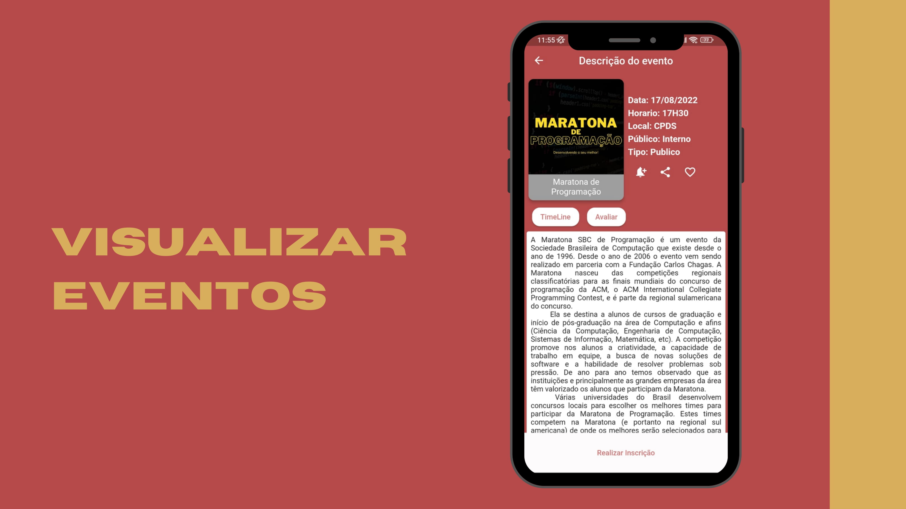

# Projeto Uesb Eventos

Aplicativo construido em Flutter para a gestão de eventos na instituição UESB. A parte inicial do projeto está concluida com a implementação das telas de login e cadastro.

## Explicando o aplicativo

Este app serve para a gerenciar eventos, possibilitando a criação, gerencimento, atribuição de eventos para organizadores, participação em eventos por parte dos usuários nos eventos cadastrados entre outras funcionalidades. 

## Funcionalidades do aplicativo até o momento
- Cadastro de usuários
- Login no sistema
- Visualização de eventos

## Utilizado no projeto
- Aplicativo desenvolvido em Flutter
- Provider para gerencimento de estado e de dependencias
- MVC+S como arquitetura de projeto(a estrutura de pasta é adaptada)
- Firebase usando o Firestore para armazenamento e o Firebase Auth para login

# Login

# Cadastro

# Outras telas

